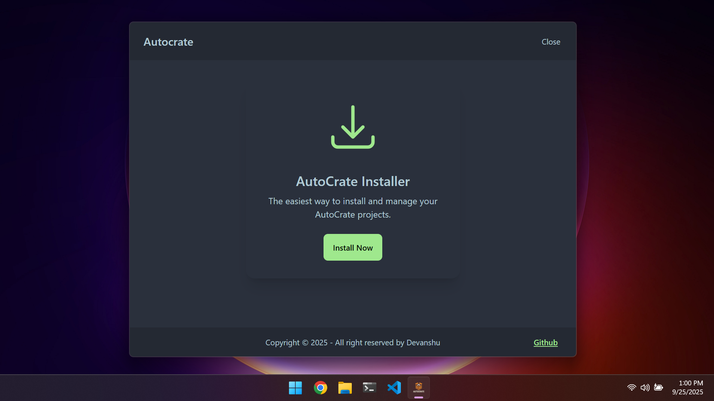

# AutoCrate Installer GUI

[](https://www.rust-lang.org/)
[](https://tauri.app/)
[](https://opensource.org/licenses/MIT)

A robust, efficient, and modern desktop installer for **AutoCrate**, built with the power of Rust and a reactive SvelteKit frontend. This isn't just an installer; it's a showcase of modern desktop application architecture.

---

## Visual Demo



---

## ## Core Features

* **Automatic Version Fetching**: Instantly retrieves the latest release data directly from the GitHub API on launch.
* **Smart Asset Detection**: Intelligently parses release assets to identify the correct installer binary for a seamless user experience.
* **Minimalist & Reactive UI**: A clean, simple interface built with SvelteKit that provides all necessary information without clutter.
* **Blazing Fast & Secure**: The performance and security of a native Rust backend with the web technologies of a modern frontend.

---

## ## Tech Stack & Architecture

This project leverages a **"Smart Backend"** architecture, where the Rust core handles all business logic, ensuring the frontend remains lean, fast, and focused purely on presentation.

* **Backend**: **Rust**. Chosen for its unmatched performance, memory safety, and powerful concurrency features.
* **Desktop Framework**: **Tauri**. Creates a lightweight, secure, and cross-platform binary by leveraging the system's native web renderer.
* **Frontend**: **SvelteKit**. A next-generation UI framework that compiles to highly optimized vanilla JavaScript.
* **Async Runtime**: **Tokio**. Powers all non-blocking network operations, ensuring the app UI is always fluid and responsive.


---

## ## Key Technical Highlights

This project was an exercise in building robust, production-ready software. Here are some of the key architectural decisions:

* **🚀 In-Memory State Management**: Implemented a thread-safe, in-memory state management system using `std::sync::Mutex` and Tauri's managed state. This caches API data on launch, eliminating redundant network calls and ensuring an instantaneous user experience.

* **📦 Clean Data Contracts with DTOs**: Designed a clean data pipeline where the Rust backend transforms raw API responses into a lean **D**ata **T**ransfer **O**bject (DTO). This minimizes the data sent to the frontend and fully decouples the backend logic from the UI implementation.

* **⚡ Asynchronous Backend**: All network requests and potential long-running operations are handled asynchronously using Rust's `async/await` syntax, guaranteeing the UI never freezes.

* **🛡️ Robust Error Handling**: Utilized Rust's `Result` and `Option` types throughout the backend to gracefully handle potential failures, from network errors to missing API data, ensuring application stability.

---

## ## Command-Line Version Available

Alongside this GUI, a powerful **command-line (CLI) version** of AutoCrate is also available, providing the same core functionality for terminal enthusiasts and automated scripting environments.

**[Check out the CLI version here!](https://github.com/SharmaDevanshu089/ac-installer)**

---

## ## Getting Started

To run this project locally, follow these steps:

1.  **Clone the repository:**
    ```bash
    git clone [https://github.com/SharmaDevanshu089/ac-installer-gui](https://github.com/SharmaDevanshu089/ac-installer-gui)
    cd ac-installer-gui
    ```

2.  **Install frontend dependencies:**
    ```bash
    npm install
    ```

3.  **Run the development env:**
    ```bash
    cargo tauri dev
    ```

---

## ## Future Goals

* Implement a full in-app download manager with progress bars, handled by the Rust backend.
* Add logic to support multiple asset types (e.g., `.msi`, `.zip`) or architectures.
* Explore persistent caching strategies for full offline support.